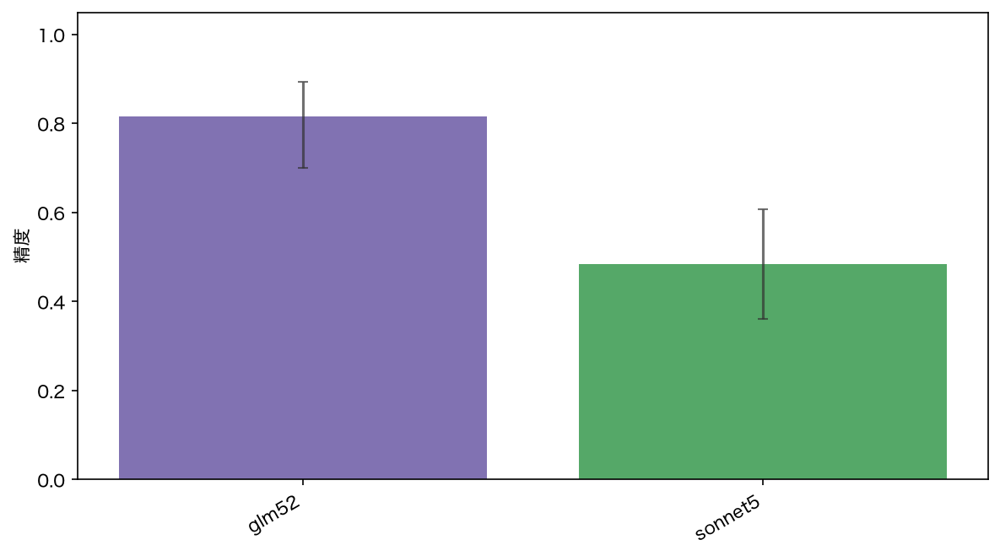
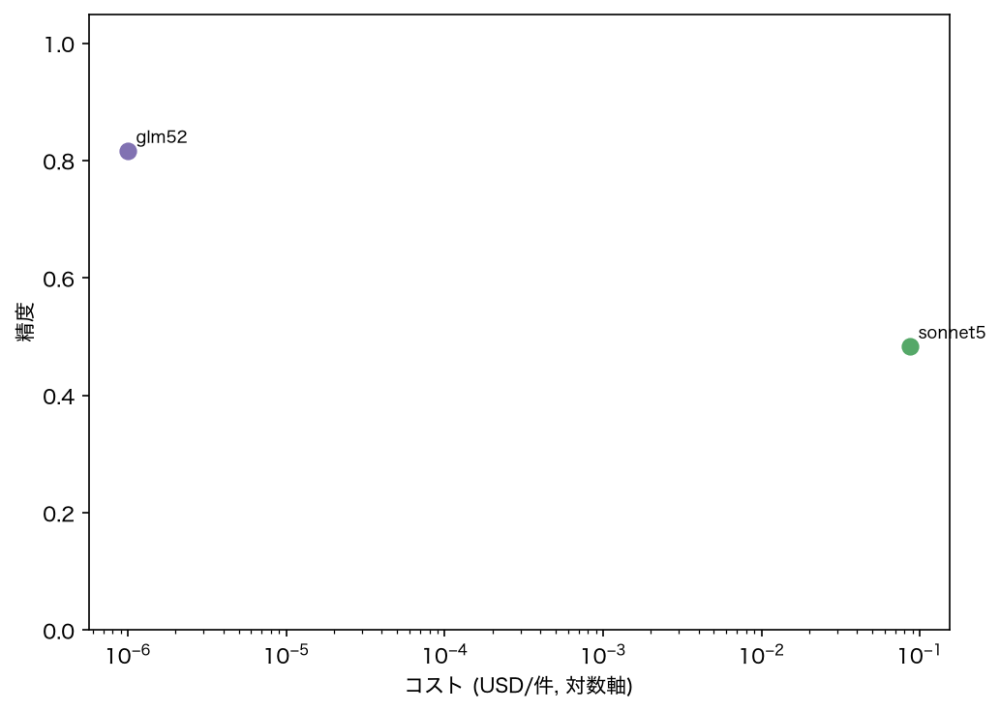
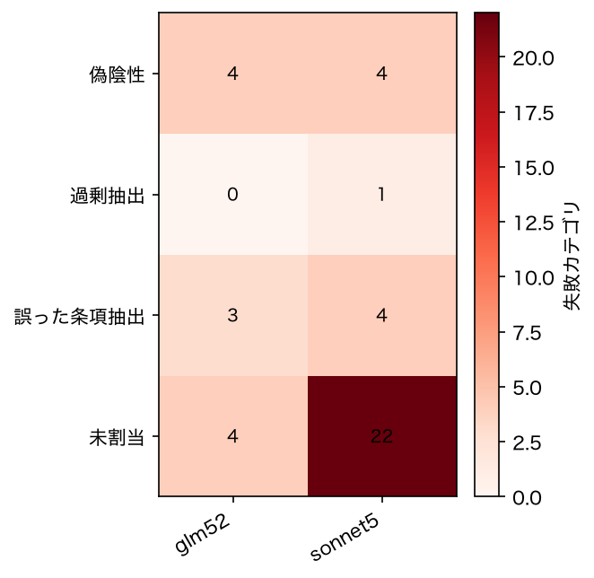

# 契約条項抽出をLLMで評価する――GLM-5.2とClaude Sonnet 5の比較、GEPA最適化から得られた知見

<!-- 公開前に固有情報や機密情報が含まれていないか目視確認すること。 -->

## 概要

英語の契約書から指定カテゴリに対応する条項を抽出するCUAD-100タスクを用い、GLM-5.2とClaude Sonnet 5の精度、コスト、レイテンシ、失敗傾向を同一条件で比較した。

60件のtest splitに対するpass率は、GLM-5.2が81.7%（49/60、Wilson 95%信頼区間：70.1–89.4%）、Claude Sonnet 5が48.3%（29/60、同36.2–60.7%）だった。記録された総コストはGLM-5.2が$0、Sonnet 5が$5.1997である。

ただし、この結果だけからGLM-5.2の方が本質的に優れているとは結論づけられない。採点モデルにもGLM-5.2を使用しており、GLM-5.2側は自己採点に相当する。また、LLMジャッジと人手ラベルの校正も未実施である。本稿ではモデルの順位よりも、評価設計、モデルごとの失敗傾向、GEPAによるプロンプト最適化、そして代理指標と最終評価のずれを中心に検証する。

## 1. 検証の目的

契約条項抽出では、関連語を含む文を返すだけでは不十分である。対象カテゴリ、当事者、権利義務の方向、条項の境界を正しく特定し、原文から必要十分なスパンを抽出する必要がある。

今回の検証では、次の3点を調べた。

1. 同一データ、同一プロンプトに対するモデル別の抽出精度
2. その精度を達成するために必要なAPIコストとレイテンシ
3. 自動プロンプト最適化によって精度を改善できるか、また目的関数の調整がモデルの挙動へどう影響するか

## 2. 評価パイプライン

評価処理は、データ構築、モデル実行、採点、失敗分析、最適化、最終評価に分離した。

```text
CUAD由来データ
    ↓ train/test分割
共通タスクプロンプト
    ↓
promptfooによるモデル実行
    ↓
LLMルーブリックによるpass/fail判定
    ↓
モデル別集計と失敗分類
    ↓
GEPAによるプロンプト候補生成
    ↓
未使用データによる評価
```

モデル実行と最終採点はpromptfooへ集約した。Pythonパッケージ`evalloop`は、データセット管理、設定生成、結果集計、失敗分析、DSPy optimizerの呼び出し、公開用成果物の生成を担当する。

### データ分割

モデル比較にはCUAD-100のtest split 60件を使用し、各モデルが同じ60件を1回ずつ処理した。

先行するGEPA実験では、構成の異なるtest 80件を使用した。そのため、最適化実験における81.2% → 60.0% → 70.0%と、後日のモデル比較における81.7%は、母数と実行時点が異なる。同一runの直接比較値として扱うことはできない。

### 最終採点

出力は完全一致ではなく、LLMルーブリックによってpass/failを判定した。表記に差があっても実質的に同じ条項を指していればpassとし、次の場合はfailとした。

- 対象カテゴリとは異なる条項を選んだ
- 当事者や権利義務の方向を取り違えた
- 必要な条項の一部しか抽出していない
- 不要な周辺条項まで過剰に含めた
- 条項が存在するにもかかわらず「該当条項なし」と回答した

ジャッジには`ollama:chat:glm-5.2:cloud`を使用した。この設定は再現条件であると同時に、今回最大の交絡要因でもある。

## 3. モデル比較の結果



| モデル | pass率 | 95%信頼区間 | 総コスト | p50レイテンシ |
|---|---:|---:|---:|---:|
| GLM-5.2 | 81.7% | 70.1–89.4% | $0.0000 | 5,738 ms |
| Claude Sonnet 5 | 48.3% | 36.2–60.7% | $5.1997 | 2,932 ms |

観測された精度はGLM-5.2の方が高かったが、中央値レイテンシはSonnet 5の約2倍だった。Sonnet 5の費用は60件で$5.1997、1件あたり約$0.087である。GLM-5.2の記録コスト$0は、今回使用したOllama Cloud経路で従量課金が評価ログへ記録されなかったことを意味し、GLM-5.2の推論コストが一般にゼロであることを意味しない。



### 失敗モード



全42失敗のうち、Sonnet 5が31件、GLM-5.2が11件だった。Sonnet 5では、条項が存在するにもかかわらず「該当条項なし」と回答する偽陰性が多かった。GLM-5.2は何らかの候補を返しやすい一方、過剰抽出、部分抽出、隣接する別条項の選択が見られた。

この差は、モデルの振る舞いと採点ルーブリックの相互作用を示す。今回のルーブリックは、実質的に同じ箇所を指す出力を許容する。そのため、候補を積極的に返すモデルが、回答を控えて「該当なし」と判断しやすいモデルより有利になる可能性がある。

## 4. GEPAによるプロンプト最適化

モデル比較に先立ち、DSPyのGEPA optimizerを使ってGLM-5.2向けのタスクプロンプトを最適化した。GEPAは数値ハイパーパラメータだけを探索するアルゴリズムではない。モデルの実行履歴、スカラー評価値、自然言語フィードバックをreflection modelへ渡し、自然言語の指示そのものを改訂する。

### 4.1 最適化ループの仕組み

今回の実験における処理を単純化すると、次のループになる。

```text
現在のプロンプト候補
    ↓
train例に対してtarget modelを実行（rollout）
    ↓
予測スパンとgoldスパンを比較
    ↓
代理指標のスカラー値と失敗理由を返す
    ↓
reflection modelが失敗傾向を診断
    ↓
改訂した指示文を候補として生成
    ↓
候補を評価し、有望なものを保持
    ↺
```

target modelは、プロンプト最適化の対象となるモデルである。reflection modelは、失敗または低スコアのrolloutを分析し、プロンプトの改善案を提案する。GEPAは単一事例だけでプロンプトを書き換えるのではなく、複数事例の実行結果から繰り返し現れる失敗を集約し、改善候補を探索する。

このループには2種類の最適化信号がある。

1. **スカラー評価値は選択圧を与える。** どの挙動がより良いかを数値で決め、候補の選抜に使われる。
2. **自然言語フィードバックは改訂方向を与える。** なぜ低スコアになったかを説明し、reflection modelが実行可能な指示へ変換する材料になる。

最終的な本番指標はLLMルーブリックによるpass/failだが、最適化ループでは決定的な文字列ベースの代理指標を使用した。rolloutごとに追加のLLMジャッジを呼ばずに済み、再現性も高くなる。一方で、代理指標と最終評価の目的が一致しなければ、GEPAは代理指標を改善しながら実際のタスク精度を悪化させる可能性がある。

今回の実験では、target modelとreflection modelの両方にGLM-5.2を使用した。v1は26 iteration・458 rollouts、v2は34 iteration・452 rolloutsを実行した。同一モデルをreflectionに使うことで費用を抑えられた一方、生成される改善案の多様性や質が制限された可能性がある。

### 4.2 v1：token F1の最大化

最初の実験では、予測スパンとgoldスパンの間で標準的なtoken F1を計算した。

```text
precision = goldと重複するtoken数 / 予測token数
recall    = goldと重複するtoken数 / gold token数
F1        = 2 × precision × recall / (precision + recall)
```

| プロンプト | pass率 | 失敗数 | ベースライン比 |
|---|---:|---:|---:|
| ベースライン | 81.2% | 15/80 | — |
| GEPA v1：token F1 | 60.0% | 32/80 | −21.3ポイント |

結果は明確な悪化だった。ケース単位では、ベースラインでpassだった19件がfailとなり、failからpassへ改善したのは2件だけだった。

生成されたプロンプトには、「最も短い句、語、または文だけを返す」「過剰抽出を厳格に避ける」に相当する指示が追加された。token F1では不要なtokenを減らすほどprecisionが上がるため、GEPAは短い出力を高得点戦略として発見したと考えられる。

しかし、この戦略は実際のタスク要件と衝突する。法的に意味のある条項を抽出するには、条件、例外、当事者間の関係を保持する必要がある。最適化後のモデルは、実際の日付ではなく`Effective Date`という見出しだけを返したり、義務を定める条項全体ではなく`Liquidated Damages`という用語だけを返したりした。

これはoptimizerが目的に従わなかったのではない。最終タスクと整合しない目的を指定したため、GEPAがそのずれを明示的なプロンプト指示へ増幅した結果である。

### 4.3 v2：recall重視のスパン指標

v2では、過剰抽出よりも過小抽出を強く罰するよう代理指標を変更した。

```text
score = 0.8 × token_recall + 0.2 × span_count_penalty
```

フィードバックもより具体的にし、完全な関連スパンを保持すること、回答を見出し語へ短縮しないこと、条項の途中で切らないことを伝えるようにした。

| プロンプト | pass率 | 失敗数 | ベースライン比 |
|---|---:|---:|---:|
| ベースライン | 81.2% | 15/80 | — |
| GEPA v1：token F1 | 60.0% | 32/80 | −21.3ポイント |
| GEPA v2：recall重視 | 70.0% | 24/80 | −11.3ポイント |

v1からv2では12件がfailからpassへ、4件がpassからfailへ変化し、差し引き8件回復した。見出し語だけを返す出力は大幅に減った。生成されたプロンプト自体にも、「関連スパンを途中で切らない」「抽出結果を一つの見出し語へ要約しない」といった指示が現れた。これらを最終候補へ手動で書き込んだのではなく、改訂した指標とフィードバックから生成された点が重要である。

それでもv2はベースラインへ到達しなかった。残った失敗の中心は、偽陰性と、隣接する誤った条項の選択だった。token overlapは、選んだスパンが間違っていることは示せても、近接する2つの条項の法的な違いを十分には説明できない。また、訓練データには正解が「該当条項なし」となるgold例が存在せず、適切な存在判定の境界を学習できなかった。

### 4.4 指標設計が生成プロンプトを変えた理由

2つの実験は、GEPAが評価指標の意味を自然言語へ変換する過程を示している。

- 対称的なtoken F1では、余分なtokenがprecisionを下げるため、短さと過剰抽出回避を重視する指示が生成された。
- recall重視の指標では、gold内容の欠落が大きく減点されるため、完全性と途中切断の防止を重視する指示が生成された。
- どちらの指標も、当事者の方向、法的カテゴリ、条項の意味を明示的に評価していないため、隣接条項の取り違えを安定して修正できなかった。

つまり、代理指標は単なる実装詳細ではない。optimizerに発見させたい挙動を定義する仕様そのものである。さらに自然言語フィードバックの内容によって、reflection modelが低スコアを実行可能な指示へ変換できるかどうかが決まる。

### 4.5 実験設計上の問題

今回のGEPA実行では独立した`valset`を渡さず、プロンプト探索に使用したtrain例と同じデータで候補を選抜した。そのため、構造的に過学習しやすい。最適化したプロンプトをtestへ繰り返し適用することも、モデルの重みを更新していなくてもメタ過学習につながる。

評価は次の3分割へ変更すべきである。

- **train：** rolloutとプロンプト改訂に使用する
- **dev：** 候補を選抜し、ベースラインを上回ったか判定する
- **test：** 昇格した最終候補を1回だけ評価する

また、最適化が完了しただけで生成プロンプトを採用してはいけない。devでベースラインを改善した候補だけを昇格させるpromotion gateが必要である。同じケースを最適化前後で評価するpaired設計なので、統計比較には独立標本としての信頼区間比較ではなく、ケース別のpass/fail遷移を使うMcNemarの正確検定が適している。

### 4.6 アルゴリズム調整から得られた知見

1. **代理指標が実質的な仕様になる。** GEPAは指標の変更を異なる指示と失敗分布へ忠実に変換した。
2. **スコアとフィードバックの役割は異なる。** スコアは候補へ選択圧を与え、フィードバックはreflection modelへ失敗原因の仮説を与える。
3. **自動最適化にはpromotion gateが必要である。** 最適化処理が正常終了したことは、ベースラインより優れたことを意味しない。
4. **train上での候補選抜は過学習を招く。** GEPAへ独立したvalidation setを渡し、testは最終段階まで温存すべきである。
5. **複合指標は最終ルーブリックを反映すべきである。** 原文抽出、完全性、不要部分、カテゴリ、当事者、方向、正しい棄権を個別に測る必要がある。
6. **プロンプトの限界とモデルの限界を分ける必要がある。** 隣接条項の混同には、追加の文言調整よりも検索とrerankingの二段構成、カテゴリ別few-shot、またはより強いtarget modelが必要な可能性がある。

## 5. 今後の調整

### 5.1 独立した採点と人手校正

境界事例を中心に少なくとも30件を人手で判定し、LLMジャッジとの一致率を測定する。一致率が不十分なら、ルーブリックを修正するか、評価対象に含まれない独立モデルへジャッジを切り替える。この工程なしでは、実品質の改善と採点モデルへの適応を区別できない。

### 5.2 train/dev/testとpromotion gate

GEPAへ明示的なvalidation setを渡す。devでベースラインを上回った候補だけをpromotedとし、testは最終候補に対して1回だけ使用する。pairedなpass/fail遷移はMcNemar検定で評価する。

### 5.3 複合代理指標

次の要素を組み合わせる。

- goldスパンに対するtoken recall
- 不要部分に対するprecisionまたは長さペナルティ
- 出力が原文の連続部分文字列であるか
- 空回答または「該当条項なし」の正誤
- overlapがほぼゼロの誤条項選択と、overlapが高い部分抽出の区別

フィードバックは失敗タイプに応じて変える。誤条項選択には、見出しの類似ではなく法的概念と当事者関係を使うよう伝える。部分抽出には、条件と例外を含む完全なスパンを保持するよう伝える。

### 5.4 データセットの改善

正解が「該当条項なし」となる負例を10–15件trainへ追加し、カテゴリ分布をtestへ近づける。隣接条項を混同しやすいカテゴリには、対照的なfew-shot例を追加する。

## 6. 限界

- GLM-5.2が自身の出力を採点しており、独立したモデル比較ではない。
- LLMジャッジと人手ラベルの一致率をまだ測定していない。
- モデル比較は各60件、最適化評価は各80件であり、詳細なカテゴリ分析には小さい。
- v1とv2の差についてpaired有意差検定を実施していない。記録された遷移は改善傾向を示すが、統計的有意性は確立していない。
- GLM-5.2の記録コスト$0は、今回の利用経路と計測方法に依存する。
- 対象は英語契約書の条項抽出であり、日本語契約書や他の抽出領域へ直接一般化できない。
- Sonnet 5は明示的なtemperatureを受け付けなかったため、sampling parameterを省略した。サンプリング条件は完全には同一でない。

## 7. 結論

60件の比較では、GLM-5.2の観測pass率は81.7%、Claude Sonnet 5は48.3%だった。ただし、GLM-5.2による自己採点と未校正ジャッジという制約があるため、この差はモデル能力の確定的な順位ではなく、現在の評価設定内での観測値として扱うべきである。

より重要な結果は、自動プロンプト最適化が必ずしもタスクを改善しないことである。通常のtoken F1を目的にしたGEPAは短い出力へ最適化し、pass率を81.2%から60.0%へ低下させた。recall重視の指標へ変更すると70.0%まで回復し、目的関数とフィードバックの設計が、GEPAの生成する指示と失敗モードを直接左右することが確認できた。

現時点では、GLM-5.2に対してベースラインプロンプトを維持するのが妥当である。次の優先事項はモデルを追加することではなく、独立ジャッジ、人手校正、3-way split、paired検定、失敗タイプを考慮した複合代理指標を整備することである。評価系が信頼できて初めて、プロンプトやモデルの改善を意味のある数字として比較できる。

## 再現方法

詳細な設定とコマンドは[conditions.md](./conditions.md)、集計結果は[tables.md](./tables.md)を参照。
