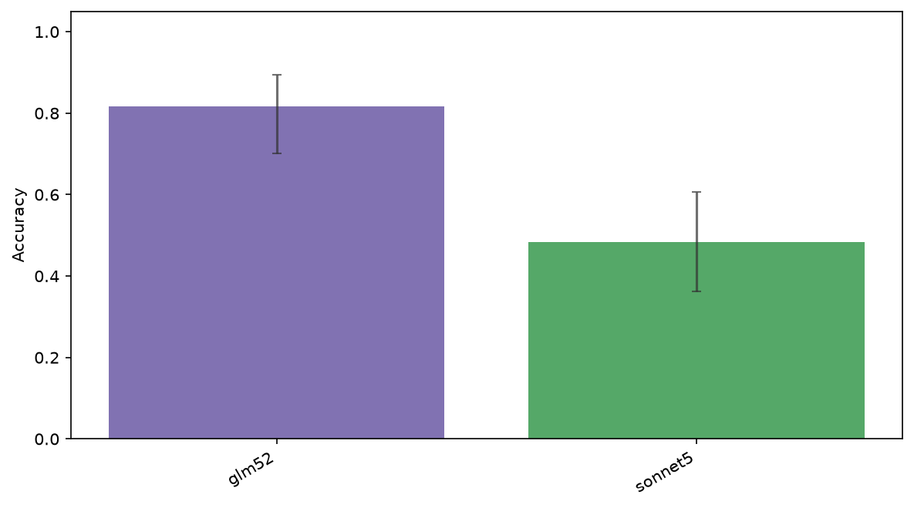
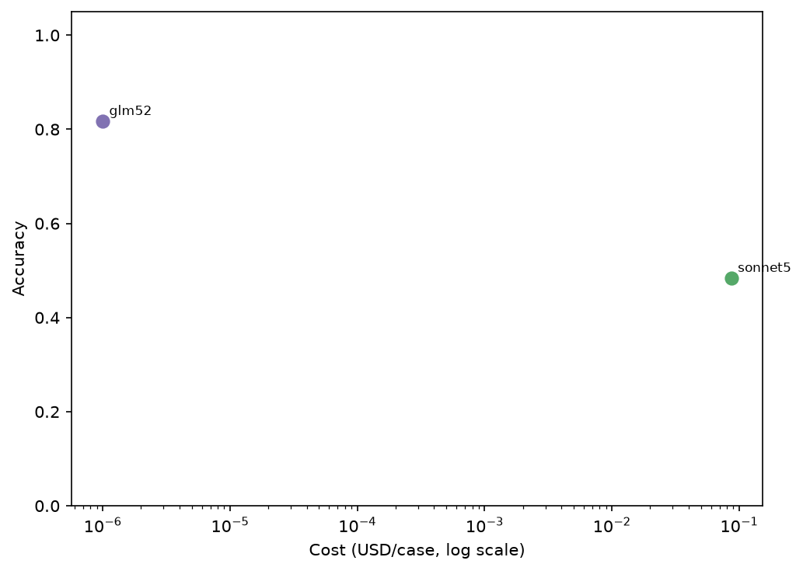
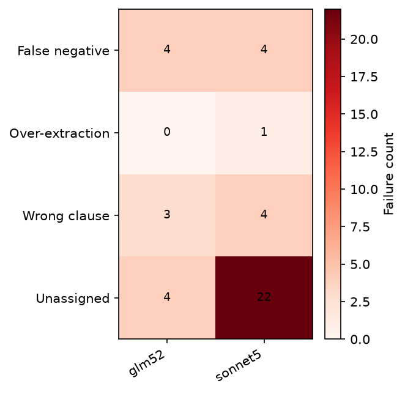

# Evaluating LLMs for Contract Clause Extraction: GLM-5.2 vs. Claude Sonnet 5 and Lessons from GEPA Optimization

<!-- Manually review for identifying or confidential information before publication. -->

## Abstract

This report compares GLM-5.2 and Claude Sonnet 5 on CUAD-100, a task that extracts clauses corresponding to specified categories from English-language contracts. Both models were evaluated under the same task prompt, and their accuracy, cost, latency, and failure modes were recorded.

On a 60-case test split, GLM-5.2 achieved an 81.7% pass rate (49/60; Wilson 95% CI: 70.1–89.4%), while Claude Sonnet 5 achieved 48.3% (29/60; 95% CI: 36.2–60.7%). Recorded total cost was $0 for GLM-5.2 and $5.1997 for Sonnet 5.

These results do not establish that GLM-5.2 is categorically the better model. GLM-5.2 was also used as the grader, making its result a form of self-evaluation, and the LLM judge has not yet been calibrated against human labels. The more useful findings concern evaluation design, model-specific failure modes, and the mismatch between the proxy metric used by GEPA prompt optimization and the final LLM-rubric objective.

## 1. Objectives

Contract clause extraction requires more than returning a sentence containing a related keyword. A system must identify the correct category, parties, direction of rights or obligations, and clause boundaries, then return a sufficient verbatim span from the source document.

This evaluation addressed three questions:

1. How accurately does each model perform under the same data and task prompt?
2. What API cost and latency are required to achieve that accuracy?
3. Can automated prompt optimization improve the result, and how does the optimization objective affect model behavior?

## 2. Evaluation Pipeline

The pipeline separates dataset construction, model execution, grading, failure analysis, optimization, and final evaluation.

```text
CUAD-derived dataset
    ↓ train/test split
Shared task prompt
    ↓
Model execution with promptfoo
    ↓
Pass/fail grading with an LLM rubric
    ↓
Per-model aggregation and failure classification
    ↓
Prompt candidate generation with GEPA
    ↓
Evaluation on held-out cases
```

Execution and final grading are centralized in promptfoo. The Python package `evalloop` manages datasets, generates configurations, aggregates results, analyzes failures, invokes DSPy optimizers, and exports publication artifacts.

### Data splits

The model comparison used 60 cases from the CUAD-100 test split. Each model processed the same cases once.

The earlier GEPA experiments used a different 80-case test configuration. The optimization sequence of 81.2% → 60.0% → 70.0% and the 81.7% result from the later model comparison therefore have different sample sizes and execution dates. They should not be presented as values from one directly comparable run.

### Final grading

Outputs were graded pass/fail with an LLM rubric rather than exact string matching. Minor textual differences could pass if the output identified substantially the same clause. An output failed when it:

- selected a clause from the wrong category;
- confused the relevant party or direction of a right or obligation;
- returned only part of the required clause;
- included excessive unrelated context; or
- claimed that no relevant clause existed when one was present.

The grader was `ollama:chat:glm-5.2:cloud`. This is both part of the reproducibility conditions and the largest confounding factor in the comparison.

## 3. Model Comparison



| Model | Pass rate | 95% CI | Total cost | p50 latency |
|---|---:|---:|---:|---:|
| GLM-5.2 | 81.7% | 70.1–89.4% | $0.0000 | 5,738 ms |
| Claude Sonnet 5 | 48.3% | 36.2–60.7% | $5.1997 | 2,932 ms |

GLM-5.2 achieved the higher observed accuracy, but its median latency was approximately twice that of Sonnet 5. Sonnet 5 cost $5.1997 for 60 cases, or about $0.087 per case. The recorded $0 for GLM-5.2 means that no usage-based charge was captured for the Ollama Cloud route used in this run; it does not mean that GLM-5.2 inference is universally free.



### Failure modes



Of 42 total failures, 31 came from Sonnet 5 and 11 from GLM-5.2. Sonnet 5 frequently produced false negatives, responding that no relevant clause existed when the contract did contain one. GLM-5.2 was more likely to return a candidate, but showed over-extraction, partial extraction, and selection of an adjacent but incorrect clause.

This difference illustrates an interaction between model behavior and the grading rubric. Because the rubric accepts an answer that points to substantially the same passage, a model that returns plausible candidates aggressively may be favored over one that more readily abstains.

## 4. GEPA Prompt Optimization

Before the model comparison, I used DSPy's GEPA optimizer to optimize the GLM-5.2 task prompt. GEPA is useful here because it does not merely search over numeric hyperparameters. It uses execution traces, scalar scores, and textual feedback to ask a reflection model to propose revised natural-language instructions.

### 4.1 How the optimization loop works

At a high level, the loop used in this experiment was:

```text
Current prompt candidate
    ↓
Run the target model on training examples (rollouts)
    ↓
Compare predictions with gold spans
    ↓
Return a scalar proxy score and textual failure feedback
    ↓
Ask the reflection model to diagnose recurring failures
    ↓
Generate a revised instruction candidate
    ↓
Evaluate and retain promising candidates
    ↺
```

The target model is the model whose prompt is being optimized. The reflection model examines failed or low-scoring rollouts and proposes edits to the instructions. GEPA accumulates evidence across examples rather than modifying a prompt from a single failure. Candidate prompts are evaluated over the training set, and the optimizer keeps candidates that improve its configured metric.

This creates two optimization channels:

1. **The scalar score determines selection pressure.** It tells the optimizer which behavior is better.
2. **Textual feedback determines the direction of revision.** It explains why an output received a low score and gives the reflection model material from which to write new instructions.

The final production metric was an LLM-rubric pass/fail judgment, but the optimization loop used a deterministic string-based proxy metric. This avoided putting another judge call inside every rollout and made optimization reproducible. It also created an objective mismatch: GEPA could improve the proxy while reducing final task accuracy.

For these experiments, GLM-5.2 served as both target and reflection model. Version 1 ran 26 iterations and 458 rollouts; version 2 ran 34 iterations and 452 rollouts. Using the same model for reflection reduced cost, but it may also have limited the diversity and quality of prompt revisions.

### 4.2 Version 1: maximizing token F1

The first experiment computed standard token F1 between the predicted span and the gold span:

```text
precision = overlapping_gold_tokens / predicted_tokens
recall    = overlapping_gold_tokens / gold_tokens
F1        = 2 × precision × recall / (precision + recall)
```

| Prompt | Pass rate | Failures | Change from baseline |
|---|---:|---:|---:|
| Baseline | 81.2% | 15/80 | — |
| GEPA v1: token F1 | 60.0% | 32/80 | −21.3 points |

The result was a clear regression. At the case level, the optimized prompt changed 19 previously passing cases into failures while repairing only two previously failing cases.

The generated prompt added instructions equivalent to “return only the shortest phrase, term, or sentence” and “strictly avoid over-extraction.” This behavior is understandable under token F1: removing extra tokens improves precision. GEPA therefore discovered that shorter outputs were often rewarded by the proxy metric.

That strategy conflicts with the task's actual requirement. A legally meaningful clause must often preserve conditions, exceptions, and the relationship between parties. The optimized model returned the heading `Effective Date` instead of the actual date, and the term `Liquidated Damages` instead of the operative clause defining the obligation.

This was not primarily a failure of the optimizer to follow its objective. It was a failure to specify an objective aligned with the final task. GEPA amplified the mismatch between token F1 and the LLM rubric into explicit prompt instructions.

### 4.3 Version 2: a recall-weighted span metric

Version 2 changed the proxy to penalize under-extraction more heavily than over-extraction:

```text
score = 0.8 × token_recall + 0.2 × span_count_penalty
```

The feedback was also made more diagnostic. Low-scoring predictions were told to preserve the complete relevant span, avoid reducing an answer to a heading, and avoid cutting a clause in the middle.

| Prompt | Pass rate | Failures | Change from baseline |
|---|---:|---:|---:|
| Baseline | 81.2% | 15/80 | — |
| GEPA v1: token F1 | 60.0% | 32/80 | −21.3 points |
| GEPA v2: recall-weighted | 70.0% | 24/80 | −11.3 points |

From v1 to v2, 12 cases changed from fail to pass and four changed from pass to fail, for a net recovery of eight cases. Heading-only outputs became substantially less common. The generated prompt itself began to include instructions such as “do not truncate the relevant span” and “do not summarize the extraction as a single heading.” These instructions were not manually inserted into the final candidate; they emerged from the revised metric and feedback.

Version 2 still did not reach the baseline. Its remaining errors were primarily false negatives and selection of an adjacent but incorrect clause. Token overlap provides a weak learning signal for these errors: it can indicate that the selected span is wrong, but not reliably explain the legal distinction between two nearby clauses. The training data also contained no gold examples whose correct answer was “no relevant clause,” so the optimizer could not learn a well-calibrated existence decision boundary.

### 4.4 Why metric design changed the generated prompt

The two experiments show how GEPA converts evaluation semantics into language:

- Under symmetric token F1, extra tokens reduced precision, so the optimizer learned brevity and strict anti-over-extraction instructions.
- Under the recall-weighted metric, missing gold content became much more expensive, so the optimizer learned completeness and anti-truncation instructions.
- Neither metric represented party direction, legal category, or clause semantics explicitly, so neither reliably corrected adjacent-clause errors.

In other words, the proxy metric is not an implementation detail. It defines the behavior that the optimizer is asked to discover. Textual feedback then determines whether the reflection model can translate a low score into an actionable instruction.

### 4.5 Structural weaknesses in the experiment

The GEPA run selected candidates using the same training examples used for prompt search because no separate `valset` was supplied. This makes overfitting structurally likely. Repeatedly evaluating optimized prompts on the test set also risks meta-overfitting, even if the model weights never change.

The evaluation should instead use three splits:

- **train:** generate rollouts and prompt revisions;
- **dev:** select candidates and decide whether an optimized prompt beats the baseline; and
- **test:** evaluate the final promoted candidate once.

An explicit promotion gate should reject an optimized prompt unless it improves over the baseline on dev. Because the same cases are evaluated before and after optimization, the statistical comparison should use paired case-level outcomes, such as an exact McNemar test, rather than treating the two pass rates as independent samples.

### 4.6 Algorithmic lessons

1. **The proxy metric is the effective specification.** GEPA faithfully converted changes in the metric into different instructions and failure distributions.
2. **Scores and feedback play different roles.** The score supplies selection pressure; feedback gives the reflection model a causal hypothesis it can express in the prompt.
3. **Automated optimization requires a promotion gate.** A generated prompt should never replace the baseline merely because optimization completed successfully.
4. **Candidate selection on train invites overfitting.** GEPA should receive a separate validation set, and the final test set should remain untouched until promotion.
5. **A composite metric should reflect the final rubric.** It should separately measure verbatim extraction, completeness, irrelevant text, category, party, direction, and valid abstention.
6. **Prompt limitations must be separated from model limitations.** Adjacent-clause confusion may require retrieval and reranking, category-specific demonstrations, or a stronger target model rather than further wording changes.

## 5. Planned Adjustments

### 5.1 Independent grading and human calibration

At least 30 boundary cases should be labeled by a human and compared with the LLM judge. If agreement is inadequate, the rubric should be revised or the grader should be replaced with an independent model that is not among the evaluated systems. Without this step, it is impossible to distinguish genuine quality improvements from adaptation to the grader.

### 5.2 Train/dev/test splits and a promotion gate

GEPA should receive an explicit validation set. Only candidates that beat the baseline on dev should be marked as promoted. The test set should be used once for the final candidate. Paired pass/fail transitions should be evaluated with McNemar's test.

### 5.3 A composite proxy metric

The next proxy should combine:

- token recall over the gold span;
- precision or a length penalty for irrelevant content;
- a check that the output is a contiguous substring of the source;
- correctness of empty or “no relevant clause” answers; and
- separate handling of near-zero-overlap wrong-clause errors and high-overlap partial extractions.

Feedback should depend on the failure type. A wrong-clause selection should instruct the model to use the legal concept and party relationship rather than heading similarity. A partial extraction should instruct it to preserve the complete span, including conditions and exceptions.

### 5.4 Dataset improvements

The training data should add 10–15 negative examples whose correct answer is “no relevant clause,” and its category distribution should more closely match the test set. Categories prone to adjacent-clause confusion should include contrastive few-shot examples.

## 6. Limitations

- GLM-5.2 graded its own output, so this is not an independent model comparison.
- Agreement between the LLM judge and human labels has not been measured.
- The comparison used 60 cases per model, while each optimization evaluation used 80; both are small for fine-grained category analysis.
- No paired significance test was run for the v1-to-v2 difference. The recorded transitions indicate improvement, but do not establish statistical significance.
- GLM-5.2's recorded $0 cost depends on the access route and measurement method used in this experiment.
- The task covers English-language contract extraction and may not generalize to Japanese contracts or other extraction domains.
- Sonnet 5 did not accept an explicit temperature parameter, so sampling parameters were omitted for that model. The sampling configurations were therefore not perfectly identical.

## 7. Conclusion

On the 60-case comparison, GLM-5.2 achieved an observed pass rate of 81.7%, compared with 48.3% for Claude Sonnet 5. Because GLM-5.2 was self-graded and the judge was not calibrated, this gap should be treated as an observation within the current evaluation setup, not a definitive ranking of model capability.

The more important result is that automated prompt optimization did not reliably improve the task. With ordinary token F1 as its objective, GEPA optimized toward shorter output and reduced the pass rate from 81.2% to 60.0%. A recall-weighted metric recovered performance to 70.0% and changed both the generated instructions and the resulting failure modes. This directly demonstrates that the objective and feedback design govern what GEPA learns to write.

For now, retaining the baseline prompt is the appropriate decision for GLM-5.2. The next priority is not adding more models, but establishing an independent judge, human calibration, a three-way data split, paired statistical testing, and a failure-aware composite proxy metric. Only after the evaluation system is trustworthy can prompt or model improvements be compared meaningfully.

## Reproduction

See [conditions.md](./conditions.md) for detailed settings and commands, and [tables.md](./tables.md) for the underlying aggregate results.
